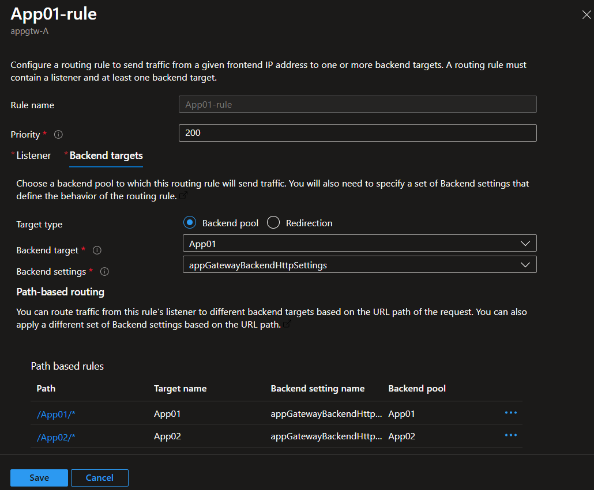

# Bypass limit of route paths of Front Door / Application Gateway

 
 
[](https://azure.microsoft.com)


This lab intends to help to handle the limit of routing paths of 200 origins of Front Door and / or 100 backends of Application Gateway, for very large deployments / migrations where all applications is under a unique URL and distributed by paths.

## Context
In large customers sometimes applications is distribuited under subdomains, and sometimes, under a unique subdomain they have more than 200 applications under different paths.


[Application Gateway path-based routing](https://learn.microsoft.com/en-us/azure/application-gateway/create-url-route-portal) can be used to route requests based on paths to different backend pools, but it have a [limit of 100 backend pools](https://learn.microsoft.com/en-us/azure/azure-resource-manager/management/azure-subscription-service-limits#azure-application-gateway-limits) for a single instance.


[Azure Front Door Routing feature](https://learn.microsoft.com/en-us/azure/frontdoor/front-door-routing-architecture?pivots=front-door-standard-premium) also can be used to route requests based on [matching of paths](https://learn.microsoft.com/en-us/azure/frontdoor/front-door-route-matching?pivots=front-door-standard-premium) to different origins groups, but it have a [limit of 200 origin groups per profile](https://learn.microsoft.com/en-us/azure/azure-resource-manager/management/azure-subscription-service-limits#azure-front-door-standard-and-premium-service-limits) (in Premium tier)


## Architecture diagram

The proposed solution for this scenario is to have a combination of Azure Front Door with Application Gateways in sequence. With this architecture, we increase the capability of path up to 20,000 applications paths (200 origin groups x 100 backend pools)


For lab proposes, in this sample it will use AKS for backend applications (under paths /App01, /App02, /App03 and /App04), distributed in a 2 Application Segments (A and B), under an Azure Front Door.

|Application Segment | Application|
|------- | -----------|
|Segment A | /App01|
|| /App02|
|Segment B | /App03|
|| /App04|


> [!IMPORTANT]
> For test the concept and demonstration purposes, we adopted a very simplified architecture. We recomment to check [MCSB - Microsoft cloud security benchmark](https://learn.microsoft.com/en-us/security/benchmark/azure/overview) to see the best practices of security adopted globally for many customers in cloud architects.


## Create enviroment
Major part of the environment is created by Azure CLi, and some another is by Azure Portal, for better undertanding of concepts.

### Prerequisites
- An Azure account with an active subscription. [Create an account for free](https://azure.microsoft.com/free/?WT.mc_id=A261C142F).

---

### Configure Resource Group

Set up the virtual networking for the environment

```bash
az group create \
    --name fd-appg-pathlimit \
    --location brazilsouth
```

### Create Cluster 01

```bash
# Create AKS 01
az aks create --resource-group fd-appg-pathlimit --name aks01 --enable-app-routing --enable-managed-identity --node-count 1 --generate-ssh-keys

#credentials
az aks get-credentials -n aks01 -g fd-appg-pathlimit

#namespace
kubectl create namespace aks-app

#Deployment
kubectl apply -f https://raw.githubusercontent.com/marcosoikawa/frontdoor-app-gateway-path-limit/refs/heads/main/deployments/aks01.yaml -n aks-app

#service
kubectl apply -f https://raw.githubusercontent.com/marcosoikawa/frontdoor-app-gateway-path-limit/refs/heads/main/deployments/service.yaml -n aks-app

#ingress
kubectl apply -f https://raw.githubusercontent.com/marcosoikawa/frontdoor-app-gateway-path-limit/refs/heads/main/deployments/ingress01.yaml -n aks-app

#verify
kubectl get ingress -n aks-app

```
### Create Cluster 02

```bash
# Create AKS 02
az aks create --resource-group fd-appg-pathlimit --name aks02 --enable-app-routing --enable-managed-identity --node-count 1 --generate-ssh-keys

#credentials
az aks get-credentials -n aks02 -g fd-appg-pathlimit

#namespace
kubectl create namespace aks-app

#Deployment
kubectl apply -f https://raw.githubusercontent.com/marcosoikawa/frontdoor-app-gateway-path-limit/refs/heads/main/deployments/aks02.yaml -n aks-app

#service
kubectl apply -f https://raw.githubusercontent.com/marcosoikawa/frontdoor-app-gateway-path-limit/refs/heads/main/deployments/service.yaml -n aks-app

#ingress
kubectl apply -f https://raw.githubusercontent.com/marcosoikawa/frontdoor-app-gateway-path-limit/refs/heads/main/deployments/ingress02.yaml -n aks-app

#verify
kubectl get ingress -n aks-app

```

### Create Cluster 03

```bash
# Create AKS 03
az aks create --resource-group fd-appg-pathlimit --name aks03 --enable-app-routing --enable-managed-identity --node-count 1 --generate-ssh-keys

#credentials
az aks get-credentials -n aks03 -g fd-appg-pathlimit

#namespace
kubectl create namespace aks-app

#Deployment
kubectl apply -f https://raw.githubusercontent.com/marcosoikawa/frontdoor-app-gateway-path-limit/refs/heads/main/deployments/aks03.yaml -n aks-app

#service
kubectl apply -f https://raw.githubusercontent.com/marcosoikawa/frontdoor-app-gateway-path-limit/refs/heads/main/deployments/service.yaml -n aks-app

#ingress
kubectl apply -f https://raw.githubusercontent.com/marcosoikawa/frontdoor-app-gateway-path-limit/refs/heads/main/deployments/ingress03.yaml -n aks-app

#verify
kubectl get ingress -n aks-app

```
### Create Cluster 04

```bash
# Create AKS 04
az aks create --resource-group fd-appg-pathlimit --name aks04 --enable-app-routing --enable-managed-identity --node-count 1 --generate-ssh-keys

#credentials
az aks get-credentials -n aks04 -g fd-appg-pathlimit

#namespace
kubectl create namespace aks-app

#Deployment
kubectl apply -f https://raw.githubusercontent.com/marcosoikawa/frontdoor-app-gateway-path-limit/refs/heads/main/deployments/aks04.yaml -n aks-app

#service
kubectl apply -f https://raw.githubusercontent.com/marcosoikawa/frontdoor-app-gateway-path-limit/refs/heads/main/deployments/service.yaml -n aks-app

#ingress
kubectl apply -f https://raw.githubusercontent.com/marcosoikawa/frontdoor-app-gateway-path-limit/refs/heads/main/deployments/ingress04.yaml -n aks-app

#verify
kubectl get ingress -n aks-app

```

### Create Application Gateways

```bash
#create nsg with app gateway rules
az network nsg create -g fd-appg-pathlimit -n pathlimit-nsg

az network nsg rule create -g fd-appg-pathlimit --nsg-name pathlimit-nsg -n app --priority 500 --source-address-prefixes Internet --destination-port-ranges 80 443 --access Allow --protocol Tcp --description "Allow Internet to apps"

az network nsg rule create -g fd-appg-pathlimit --nsg-name pathlimit-nsg -n appgtw-mgr --priority 501 --source-address-prefixes GatewayManager --destination-port-ranges 65200-65535 --access Allow --protocol Tcp --description "Allow gateway manager inbond as per doc"

#create vnet
az network vnet create --name pathlimit-vnet --resource-group fd-appg-pathlimit --location brazilsouth --address-prefix 10.24.0.0/16 --subnet-name appgtwsubnet --nsg pathlimit-nsg --subnet-prefix 10.24.0.0/24


#create public ip Gateway Segment A
az network public-ip create --resource-group fd-appg-pathlimit --name appgtw-a-pip --allocation-method Static --sku Standard

#create public ip Gateway Segment B
az network public-ip create --resource-group fd-appg-pathlimit --name appgtw-b-pip --allocation-method Static --sku Standard

#create Application Gateway Segment A
az network application-gateway create --name appgtw-A --location brazilsouth --resource-group fd-appg-pathlimit --capacity 2 --sku Standard_v2 --public-ip-address appgtw-a-pip --vnet-name pathlimit-vnet --subnet appgtwsubnet --priority 100

#create Application Gateway Segment B
az network application-gateway create --name appgtw-B --location brazilsouth --resource-group fd-appg-pathlimit --capacity 2 --sku Standard_v2 --public-ip-address appgtw-b-pip --vnet-name pathlimit-vnet --subnet appgtwsubnet --priority 100
```

### Creating backend pools for Application Gateways
```bash
#Backend Pool for AKS01
az aks get-credentials -n aks01 -g fd-appg-pathlimit

ADDRESS=$(kubectl get ingress -n aks-app -o jsonpath='{.items[0].status.loadBalancer.ingress[0].ip}')

az network application-gateway address-pool create -g fd-appg-pathlimit --gateway-name appgtw-A -n App01 --servers $ADDRESS


#Backend Pool for AKS02
az aks get-credentials -n aks02 -g fd-appg-pathlimit

ADDRESS=$(kubectl get ingress -n aks-app -o jsonpath='{.items[0].status.loadBalancer.ingress[0].ip}')

az network application-gateway address-pool create -g fd-appg-pathlimit --gateway-name appgtw-A -n App02 --servers $ADDRESS

#Backend Pool for AKS03
az aks get-credentials -n aks03 -g fd-appg-pathlimit

ADDRESS=$(kubectl get ingress -n aks-app -o jsonpath='{.items[0].status.loadBalancer.ingress[0].ip}')

az network application-gateway address-pool create -g fd-appg-pathlimit --gateway-name appgtw-B -n App03 --servers $ADDRESS

#Backend Pool for AKS04
az aks get-credentials -n aks04 -g fd-appg-pathlimit

ADDRESS=$(kubectl get ingress -n aks-app -o jsonpath='{.items[0].status.loadBalancer.ingress[0].ip}')

az network application-gateway address-pool create -g fd-appg-pathlimit --gateway-name appgtw-B -n App04 --servers $ADDRESS

#create health probe Application Gateway Segment A
az network application-gateway probe create -g fd-appg-pathlimit --gateway-name appgtw-A -n urlProbe --protocol http --host "127.0.0.1" --path "/"


#create health probe Application Gateway Segment B
az network application-gateway probe create -g fd-appg-pathlimit --gateway-name appgtw-A -- -n urlProbe --protocol http --host "127.0.0.1" --path "/"

```
### Configure Application Gateway for Segment A
Some configuration will be in Portal to better understand the concepts

#### Edit current listener
1. In [Azure Portal](https://portal.azure.com), search for Application Gateway.
1. In left menu, click on Listeners.
1. Click on Add Listener, click on current listener, edit port to 8080.
1. Click on Save.


#### Add a listener on port 80.
1. Go to: Application Gateway / Listeners / Add listener
1. Add a listener according the values:

|Name|Value|
|-------|-----|
|**Listener name**|appGateway80Listener|
|**Frontend IP**|Public|
|**Protocol**|HTTP|
|**Port**|80|
|**Listener type**|Basic|
|**Bad Gateway - 502**|*leave blank*|
|**Forbidden - 403**|*leave blank*|
    


3. Click Add.

#### Add a rule
This the configuration that will route the /App01 and /App02 to respecitives backends of applications.

1. In left menu, click on "Rules" / "+ Routing Rule"
In Add routing rule page, add folowing values: 

|Name|Value|
|-------|-----|
|**Rule name**|App-rules|
|**Priority**|200|
|**Listener**|appGateway80Listener|

2. In Tab Backend targets, add the values of the following table:

|Name|Value|
|--------------|-----|
|**[Backend targets tab] Target Type**|Backend pool|
|**[Backend targets tab] Backend target**|App01|
|**[Backend targets tab] Backend target**|appGatewayBackendHttpSettings|
|**[Backend targets tab] Add multiple targets to create a path-based rule**|*click to add*|


3. Click "Add multiple targets to create a path-based rule"


4. Add a route for App01 according this values: 

|Name|Value|
|-------|-----|
|**Target type**|Backend pool|
|**Path**|/App01|
|**Target name**|App01|
|**Backend settings**|appGatewayBackendHttpSettings|
|**Backend target**|App01|


5. Click Save.

6. Then, cllick again in "**Add multiple targets to create a path-based rule**", and App a routing rule for App02, accoring the following values

|Name|Value|
|-------|-----|
|**Target type**|Backend pool|
|**Path**|/App02|
|**Target name**|App02|
|**Backend settings**|appGatewayBackendHttpSettings|
|**Backend target**|App02|

7. Click Add.
8. Final result shoud be somehting like this:




9. Final, click in Add, to Add entire Routing Rule with paths to App01 and App02

### Configure Application Gateway appgtw-B for Segment B
Now, repeat the last sections to configure the Application Gateway for Segment B, routing to /App03 and /App04.

### Creating Front Door

Now, these are the steps to create and configure Front Door.

```bash

#create Front Door profile
az afd profile create --profile-name fd-pathlimit --resource-group fd-appg-pathlimit --sku Premium_AzureFrontDoor

#create Front Door endpoint
az afd endpoint create --resource-group fd-appg-pathlimit --endpoint-name fd-pathlimit --profile-name fd-pathlimit --enabled-state Enabled
```
#### Creating Origin Group (Segment A and B)

```bash
# Segment A Origin Group
az afd origin-group create --resource-group fd-appg-pathlimit --origin-group-name SegmentA-og --profile-name fd-pathlimit --probe-request-type GET --probe-protocol Http --probe-interval-in-seconds 60 --probe-path / --sample-size 4 --successful-samples-required 3 --additional-latency-in-milliseconds 50

# Segment B Origin Group
az afd origin-group create --resource-group fd-appg-pathlimit --origin-group-name SegmentB-og --profile-name fd-pathlimit --probe-request-type GET --probe-protocol Http --probe-interval-in-seconds 60 --probe-path / --sample-size 4 --successful-samples-required 3 --additional-latency-in-milliseconds 50

```
#### Creating Origin in Origin Group for Segment A
1. In Azure Portal, search for Front Door, and click on fd-pathlimit profile.
1. In Origin Groups, click on "SegmentA-og" / "+ Add an origin"


1. Add a origin point to Application Gateway representing the Apps for Segment A, accoring with following values:

|Name|Value|
|-------|-----|
|**Name**|SegmentA-origin|
|**Origin Type**|Application Gateway|
|**Host Name**|appgtw-A (Public IP xxx)|
|**Origin host header**|*Leave default ip autofilled*|
|**HTTP port**|*Leave default*|
|**HTTPS port**|*Leave default*|
|**Priority**|*Leave default*|
|**Weight**|*Leave default*|


1. Click "Add".
1. And then click "Update" to update entire origin group with new origin.

#### Creating Origin in Origin Group for Segment B
Repeat the steps for "SegmentB-og", now point to appgtw-B.

|Name|Value|
|-------|-----|
|**Name**|SegmentB-origin|
|**Origin Type**|Application Gateway|
|**Host Name**|appgtw-B (Public IP xxx)|
|**Origin host header**|*Leave default ip autofilled*|
|**HTTP port**|*Leave default*|
|**HTTPS port**|*Leave default*|
|**Priority**|*Leave default*|
|**Weight**|*Leave default*|

#### Creating Route for Segment A

Now finally, lets create the rules for Front Door

1. In Azure Portal, search for Front Door, and click on fd-pathlimit profile.
2. In left menu, click on "Front Door Manager" / "Add route"


3. Add a route according following values

|Name|Value|
|-------|-----|
|**Name**|segmentA-route|
|**Endpoint**|*Leave default*|
|**Enable route**|checked|
|**Domains**|*Leave default*|
|**Patterns to match**|*/App01*|
||*/App02*|
|**Redirect**|***unchecked***|
|**Origin group**|*SegmentA-og*|
|**Forwarding protocol**|*Match incoming request*|
|**Caching**|*Leave unchecked*|

4. Click "Add", to add new route for Segment A

> [!WARNING]
> For test and demonstration purposes, we are working only in HTTP. For any kind of use (production / homolog / even desenv), it's recommended to use HTTPS protocol, marking redirect checkbox to "Redirect all traffic to use HTTPS" 


#### Creating Route for Segment B
Now add a new role for Segment B, using /App03 and /App04, point to SegmentB-og Origin Group

|Name|Value|
|-------|-----|
|**Name**|segmentB-route|
|**Endpoint**|*Leave default*|
|**Enable route**|checked|
|**Domains**|*Leave default*|
|**Patterns to match**|*/App03*|
||*/App04*|
|**Redirect**|***unchecked***|
|**Origin group**|*SegmentB-og*|
|**Forwarding protocol**|*Match incoming request*|
|**Caching**|*Leave unchecked*|

## Testing
Now test to call url of Front Door with /App01, /App02, /App03 and /App04. You shoud see all application working with the routes we configured.


## Learn more
[Azure Front Door documentation](https://learn.microsoft.com/en-us/azure/frontdoor/)

[Application Gateway documentation](https://learn.microsoft.com/en-us/azure/application-gateway/overview)


## Feedbacks

This quickstart is a open source IP. Your feedback is essential to improve services and documentation. 
You can share your feedback either by dropping us an issue in this repo or sending us a message on LinkedIn profiles, to one of the principal authors:

- [Marcos Hirohsi Oikawa](https://www.linkedin.com/in/marcos-hiroshi-oikawa) | Technical Specialist
- [Leandro Oliveira](https://www.linkedin.com/in/so-leandro/) | Technical Specialist
- [Augusto Wagner de Araujo](https://www.linkedin.com/in/augustowagner/) | Cloud Solution Architect
- [Igor de Aguiar](https://www.linkedin.com/in/igor-de-aguiar/) | Cloud Solution Architect

*To see non-public LinkedIn profiles, sign in to LinkedIn.*

## Contributing

This project welcomes contributions and suggestions.  Most contributions require you to agree to a
Contributor License Agreement (CLA) declaring that you have the right to, and actually do, grant us
the rights to use your contribution. For details, visit https://cla.opensource.microsoft.com.

When you submit a pull request, a CLA bot will automatically determine whether you need to provide
a CLA and decorate the PR appropriately (e.g., status check, comment). Simply follow the instructions
provided by the bot. You will only need to do this once across all repos using our CLA.

This project has adopted the [Microsoft Open Source Code of Conduct](https://opensource.microsoft.com/codeofconduct/).
For more information see the [Code of Conduct FAQ](https://opensource.microsoft.com/codeofconduct/faq/) or
contact [opencode@microsoft.com](mailto:opencode@microsoft.com) with any additional questions or comments.

## Trademarks

This project may contain trademarks or logos for projects, products, or services. Authorized use of Microsoft 
trademarks or logos is subject to and must follow 
[Microsoft's Trademark & Brand Guidelines](https://www.microsoft.com/en-us/legal/intellectualproperty/trademarks/usage/general).
Use of Microsoft trademarks or logos in modified versions of this project must not cause confusion or imply Microsoft sponsorship.
Any use of third-party trademarks or logos are subject to those third-party's policies.
